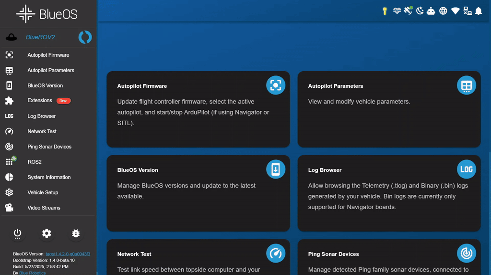

<p align="center">
<a href="https://github.com/itskalvik/blueos-ros2">
 
</a></p>

The BlueOS ROS2 Extension bridges the [BlueOS](https://bluerobotics.com/blueos-conversion/) and [ROS2](https://github.com/ros2) ecosystems, enabling advanced robotic applications and research on ArduPilot-based vehicles such as the BlueBoat and BlueROV2.

This extension provides drivers and tools for controlling vehicles and visualizing onboard sensor data. It simplifies the process of setting up a ROS 2 environment for marine robotics by offering pre-configured packages for sonar, cameras, and vehicle control—ready to use out of the box.

In addition, it includes a web-based terminal for convenient access to the ROS 2 environment and integrates seamlessly with **Foxglove** for browser-based data visualization.

<p align="center">
 
</p>

# 🚀 Features

This extension includes the following [ROS 2 Jazzy](https://docs.ros.org/en/jazzy/index.html) packages:

- **[mavros_control](https://github.com/itskalvik/mavros_control)**

  A Python-based control interface built on [MAVROS](https://github.com/mavlink/mavros)
  * Supports GPS waypoint navigation (BlueBoat) and RC control (BlueROV2)
  * Includes methods for arming/disarming, takeoff/landing, setting home location, and waypoint following
  * Easily subclass or use as-is to skip writing repetitive boilerplate code

- **[gscam2](https://github.com/clydemcqueen/gscam2)**

  A ROS 2 driver for GStreamer-based video streams, with support for intra-process communication to maximize performance.

- **[bluerobotics_sonar](https://github.com/itskalvik/bluerobotics_sonar)**

  Drivers for Blue Robotics Ping1D altimeter and Ping360 scanning sonar.
  * Nodes for direct hardware interfacing and real-time data visualization

- **[sonoptix_sonar](https://github.com/itskalvik/sonoptix_sonar)**

  Drivers and data processing tools for the Sonoptix Echo sonar.
  * Nodes for direct hardware interfacing and real-time data visualization

- **[ros-foxglove-bridge](https://app.foxglove.dev/)**

  A WebSocket bridge to stream ROS 2 data into the Foxglove web interface.
  * Fully compatible with the BlueOS Foxglove plugin


## 📋 Prerequisites

- A 64-bit version of [BlueOS](https://github.com/bluerobotics/BlueOS) is required. 

  👉 Download the latest Raspberry Pi image from the [BlueOS Releases page](https://github.com/bluerobotics/BlueOS/releases/).


## 🧰 Installation
You can install the ROS 2 Extension directly from the **BlueOS App Store**


<p align="center">
 
</p>


## ⚙️ Usage
- **Automatic Launch:** The extension launches automatically when BlueOS boots.
- **Web Terminal:** Access the extension’s terminal via the left-hand panel in the BlueOS UI.
- **Persistent Storage:** The extension links the following directories
  - Host path: ```/usr/blueos/extensions/ros2/```
  - Container path: ```/root/persistent_ws/```

  Use this to store files like custom ROS 2 workspaces or configuration files that need to survive reboots.

<p align="center">
 
</p>

## 🛠️ Build and Run Locally

To build the extension for multiple architectures (`arm64`, `amd64`) using [Docker](https://www.docker.com/):

### 1. Set Up Multi-Architecture Builder

```bash
docker buildx create --name multi-arch \
  --platform "linux/arm64,linux/amd64" \
  --driver "docker-container"
docker buildx use multi-arch
```

### 2. Clone the Repository and Build the Container

```bash
git clone --recurse-submodules https://github.com/itskalvik/blueos-ros2
cd blueos-ros2
docker compose build
```

### 3. Run the Container

```bash
docker compose up -d
```

The extension will be accessible at: [http://localhost:4717/](http://localhost:4717/)

## 🤓 Manual Installation in BlueOS

* Connect to BlueOS in your browser:
  * Via Wi-Fi AP: [http://blueos-hotspot.local/](http://blueos-hotspot.local/)
  * On the same network: [http://blueos-avahi.local/](http://blueos-avahi.local/)
* Navigate to the ```Extensions``` tab, then switch to the ```INSTALLED``` tab.
* Click the ```+``` button (bottom-right), and fill in the fields:
    * Extension Identifier: ```ItsKalvik.ROS2```
    * Extension Name: ```ROS2```
    * Docker image: ```YOURDOCKERHUBUSER/YOURDOCKERHUBREPO```
    * Docker tag: ```latest```
    * Original Settings:
      ```json
      {
        "NetworkMode": "host",
        "HostConfig": {
          "Binds": [
            "/dev:/dev:rw",
            "/usr/blueos/extensions/ros2/:/root/persistent_ws/:rw"
          ],
          "Privileged": true,
          "NetworkMode": "host",
          "CpuQuota": 100000,
          "CpuPeriod": 100000
        },
        "Env": []
      }
      ```
* Click ```CREATE``` to complete the installation.